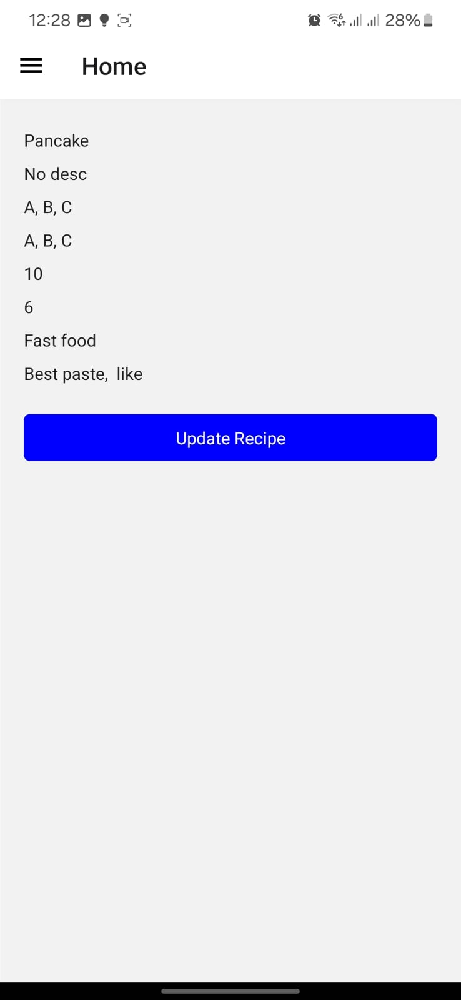

# ChefConnect Mobile App

ChefConnect is a mobile recipe-sharing app built with React Native, MongoDB, Express, Node.js, and Tailwind CSS. It allows users to discover, save, and share recipes securely. Additionally, it incorporates AI-powered features for calorie counting, food recognition, and personalized recipe recommendations. This README.md file provides an overview of the project, installation instructions, and usage guidelines.

## User Interface


## Features

- Explore a diverse range of recipes.
- Create and customize your own recipes.
- Share and receive reviews on recipes.
- Ensure user authentication and authorization.
- Enjoy AI-powered recipe recommendations based on preferences, dietary restrictions, and available ingredients.
- Use AI to count calories and recognize food items from photos.
- Experience a seamless mobile experience with a responsive design.

## Technologies Used

- Frontend: React Native
- Backend: MongoDB, Express, Node.js
- Styling: Tailwind CSS
- Authentication: JWT (JSON Web Tokens)
- AI Services:
  - Gemini API for recipe recommendations
  - Python Flask server for deploying AI models
  - Keras and TensorFlow for training and loading deep learning models (CNN)

## Installation

To run the ChefConnect mobile app locally, follow these steps:

1. Clone the repository:
   ```bash
   git clone https://github.com/Qamar2315/chefconnect-mobile-app.git
   ```

2. Navigate to the project directory:
    ```
    cd chefconnect-mobile-app
    ```

3. Navigate to client and install dependencies:
    ```
    cd client
    npm install
    ```

4. Navigate to server and install dependencies:
    ```
    cd server
    npm install
    ```

5. Configure environment variables

6. Run client:
    ```
    cd client
    npm start
    ```

7. Run server on seperate terminal:
    ```
    cd server
    npm start
    ```
    
8. Run AI Flask server:
    ```
    cd dl_server
    python app.py
    ```
    
9. Open the app on your mobile device using the Expo Go app or an emulator.

# Usage

1. Sign up or log in to your ChefConnect account.
2. Browse recipes, create your own, and add reviews.
3. Explore various categories and cuisines to discover new recipes.
4. Use the AI features to get personalized recipe recommendations, count calories, and recognize food items from photos.
5. Enjoy a seamless recipe-sharing experience on your mobile device.

# Contributing

Contributions are welcome! Please fork the repository and submit a pull request with your enhancements or bug fixes.

# License

This project is licensed under the MIT License. See the [LICENSE](LICENSE) file for details.
